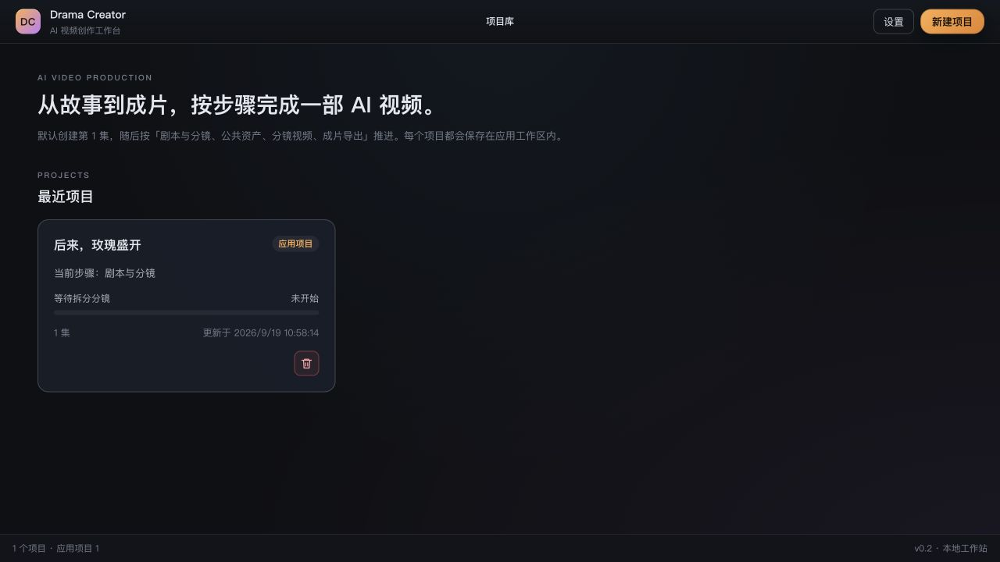

# Drama Creator

本地优先的 AI 视频与短剧制作工作台，作为独立应用维护。按故事与分镜、公共资产、分镜视频、成片导出组织创作。

## 成果展示

[观看《后来，玫瑰盛开》](https://jimeng.jianying.com/s/qpPkdrDp1AA/) · [作品展示与访问说明](docs/showcase.md)。作品在原平台观看；剧本、分镜提示词、制作素材和工程文件不随源码分发。

## 界面预览

以下展示作者已公开作品《后来，玫瑰盛开》的名称与获准展示的素材。截图来自仅装入选定素材的独立展示工作区，不代表原完整工程的制作进度；未对截图进行遮挡、拼接或修图。




## 从源码运行

```sh
npm ci
npm run dev
```

浏览器访问 http://127.0.0.1:5173/ 。完整功能依赖本地 Node 服务；不能只部署静态文件。原生依赖 keytar 可能需要平台编译工具。具体本次验证环境见 [发布验证](docs/release-validation.md)。

创建项目后可使用 [公开演示故事](samples/build-week-story.txt)。手动编辑与导入可独立使用；模型生成需自行配置服务与凭据。没有模型凭据不代表已验证真实生成能力。

## 数据与隐私

应用默认数据目录是 `~/.drama-creator/`。用户选择或注册的 workspace 保存外部项目。源码仓库与作品目录应分开，作品文件不需要上传 GitHub。API key 和 OAuth 凭据的持久化设计使用系统钥匙串；真实授权链路的验证范围见发布记录。

## 开发与桌面构建

```sh
npm test
npm run build
npm run check:tauri-env
npm run build:tauri
```

桌面构建需要 Rust 及对应系统构建工具。macOS 产物由 Tauri 与内置 Node sidecar 组成；成片处理还依赖 FFmpeg；烧录字幕需要带 libass/subtitles 滤镜的版本（macOS 可安装 ffmpeg-full）。平台支持、签名与安装包状态以发布记录为准。

即梦浏览器自动化使用应用托管 profile，在最终生成前保留人工确认。生成后需手动下载并导入。第三方服务的授权、额度及可用性由各服务商决定；仓库包含某个适配器不代表服务商批准其使用，也不承诺订阅额度可被第三方应用复用。

## 文档与贡献

- [产品文字规范](docs/prd-drama-creator-redesign.md)
- [适配器契约](docs/adapter-contract.md)
- [贡献指南](CONTRIBUTING.md)
- [安全反馈](SECURITY.md)

## 许可

源码及作者授权的 [应用图标](src-tauri/icons/README.md)采用 [Apache-2.0](LICENSE)。第三方依赖保留各自许可，见 [依赖说明](THIRD_PARTY_NOTICES.md)。外链作品及其素材、截图中作品画面不随源码授权，展示图片的权利说明见 [截图说明](docs/assets/public-demo/README.md)。原始私有设计图、创作项目和旧开发历史不在本公开快照中。
