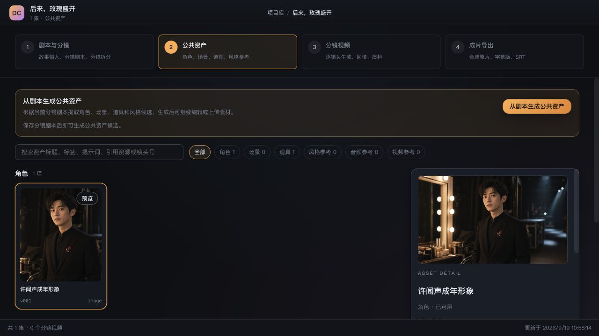

# 成果展示

本页通过外链展示使用 Drama Creator 制作的作品。点击作品链接后在原发布平台观看；此仓库不托管作品视频，也不提供作品工程、剧本、分镜提示词或完整制作素材；经作者允许的选定素材仅在展示截图中出现。

## 后来，玫瑰盛开

作者已确认作品公开，并授权在项目介绍中展示对应素材。

[在即梦观看《后来，玫瑰盛开》](https://jimeng.jianying.com/s/qpPkdrDp1AA/)

访问提示：若分享链接跳转到首页，可尝试登录即梦后重新打开。本次未登录浏览器未成功进入播放页，尚未验证访客直接播放。

截图取自仅装入选定素材的展示工作区，不代表原工程的完整进度。

<!-- 维护说明：仅录入作者提供的已发布作品链接。每项填写允许公开的标题、简短介绍及实际使用的应用能力；不要将表格模板中的示例当作真实作品。默认只放文字链接，不抓取视频或封面。 -->
<!-- 条目格式：作品名称 | 简介 | 实际使用的应用能力 | 平台名称与观看链接。发布前检查未登录访客是否可访问；需要登录时明确标注。验证时间及结果留在内部发布记录。 -->

## 作品权利

应用源码的开源许可不包含外链作品及其制作素材。观看、使用和转载以作品权利人及原发布平台的授权说明为准。
